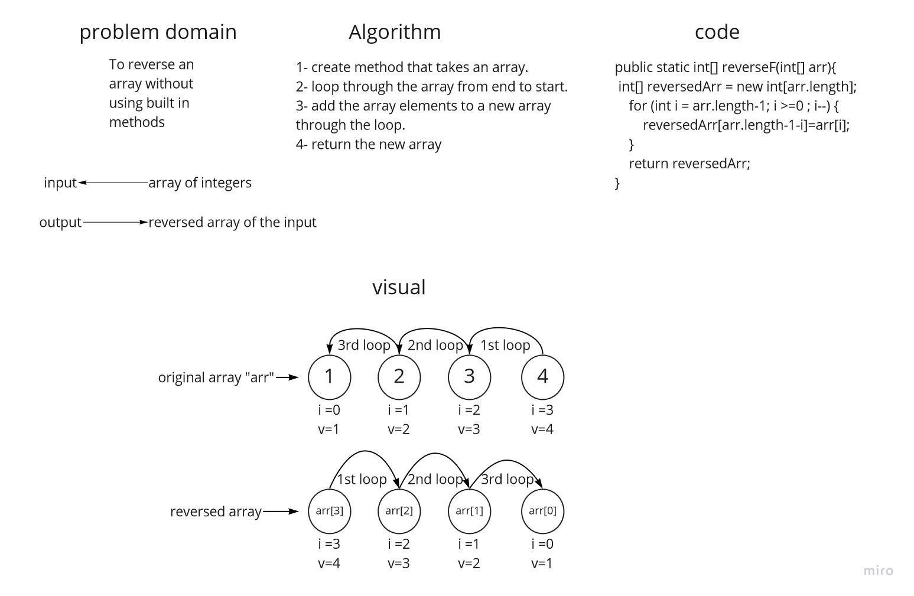

# Reverse an Array
### this challenge is about writing a function which takes an array as argument, and return an array with the reversed values of the original one, without using built in methods.

## Whiteboard Process

