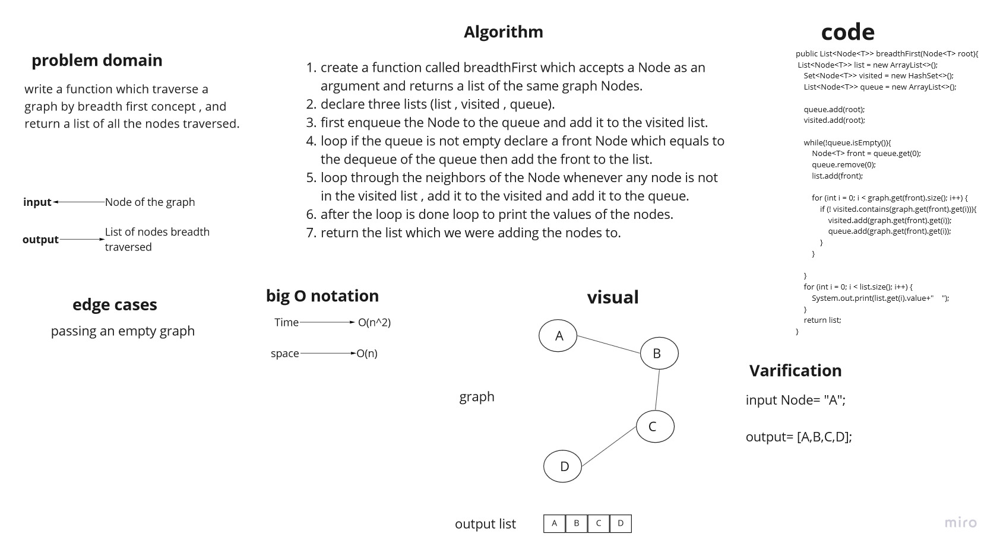
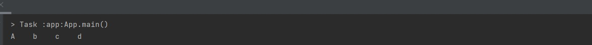

# Challenge Summary

write a function which traverse a graph by breadth first concept , and return a list of all the nodes traversed.

## Whiteboard Process



## Approach & Efficiency

the big O notation for the breadthFirst method is:
space = O(n)   because we declared a list
time = O(n^2)   because we use a nested loop

## Solution

this is a sample of the code :

```
       Graph<String> testing = new Graph<>();
        Node a = testing.addNode("A");
       Node b =  testing.addNode("b");
        Node c = testing.addNode("c");
        Node d = testing.addNode("d");

        testing.addEdge(a,b,true);
        testing.addEdge(b,c,true);
        testing.addEdge(c,d,true);
        testing.addEdge(b,d,true);

        testing.breadthFirst(a);
```

this is its output:

