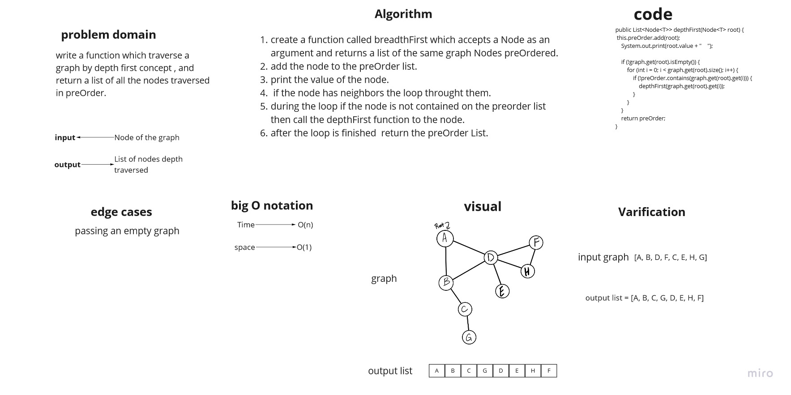
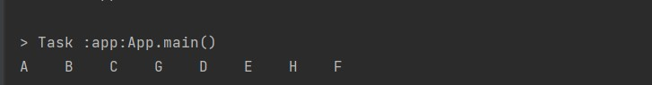

# Challenge Summary

write a function which traverse a graph by depth first concept , and return a list of all the nodes traversed..

## Whiteboard Process



## Approach & Efficiency

the big O notation is:
O(n) for time because we use a loop .
O(1) for space because we didnt create a new list we only pass to an already created list.

## Solution

this is a sample of the code:

```
Graph<String> graph = new Graph<>();

        Node a = graph.addNode("A");
        Node b =  graph.addNode("B");
        Node c = graph.addNode("C");
        Node d = graph.addNode("D");
        Node e = graph.addNode("E");
        Node f = graph.addNode("F");
        Node g = graph.addNode("G");
        Node h = graph.addNode("H");

        graph.addEdge(a,b,true);
        graph.addEdge(a,d,true);
        graph.addEdge(b,c,true);
        graph.addEdge(b,d,true);
        graph.addEdge(c,g,true);
        graph.addEdge(d,e,true);
        graph.addEdge(d,h,true);
        graph.addEdge(d,f,true);
        graph.addEdge(h,f,true);


        graph.depthFirst(a);
```

and here is the output of it:


