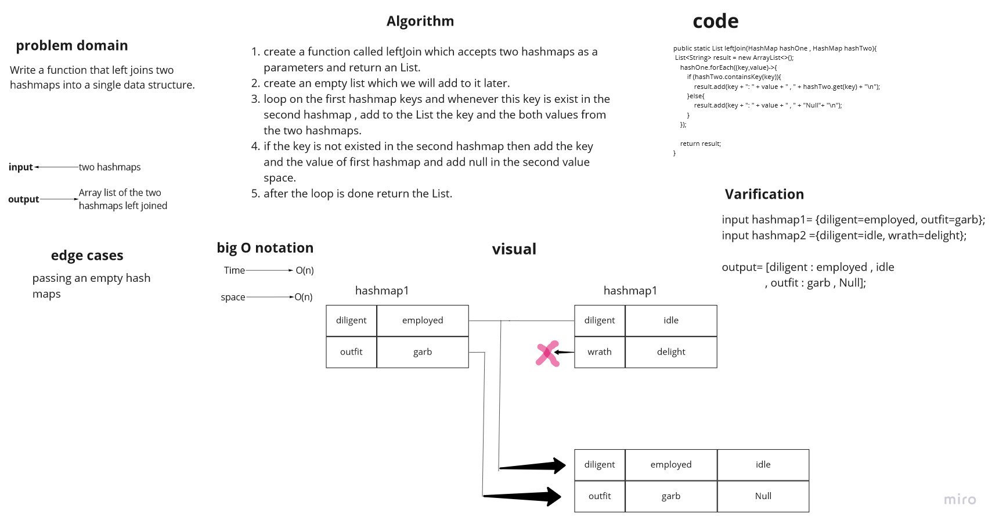

# Hashmap LEFT JOIN

Implement a simplified LEFT JOIN for two Hashmaps.

## Challenge

Write a function that LEFT JOINs two hashmaps into a single data structure.

## Approach & Efficiency

the big O notation of the function is :
time complexity = O(n)   because we use a loop.
space complexity = O(n)   because we declared a List.

## Solution

