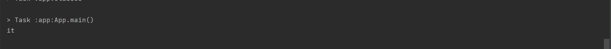

# Challenge Summary

Write a function called repeated word that finds the first word to occur more than once in a string

## Whiteboard Process


## Approach & Efficiency

the big O notation of the function is O(n) for both time and space because we used a loop and we create a new array.

## Solution

this is an example of how to use the code:

```
String words = "It was the best of times, it was the worst of times,";
        System.out.println(repeatedWord(words));
```
here is the output of it:


