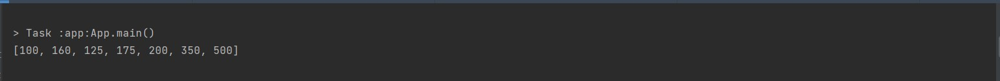

# Challenge Summary
write a function which accepts two binary trees and return a list of the intersection values between the trees.


## the code is inside the trees project because i used the binary tree implimentation.
code : [code location](../trees/app/src/main/java/trees/App.java)


## Whiteboard Process

## Approach & Efficiency
the big O notation is O(n) for both time and space complexity , because we used a loop and we create a list.

## Solution
here is a sample of the code:

```
BinaryTree<Integer> tree1 = new BinaryTree<>(150);
        tree1.root.rightChild = new Node<>(250);
        tree1.root.leftChild = new Node<>(100) ;
        tree1.root.rightChild.rightChild = new Node<>(350);
        tree1.root.rightChild.rightChild.rightChild =new Node<>(500) ;
        tree1.root.rightChild.rightChild.leftChild =new Node<>(300) ;
        tree1.root.rightChild.leftChild =new Node<>(200) ;
        tree1.root.leftChild.leftChild =new Node<>(75) ;
        tree1.root.leftChild.rightChild =new Node<>(160) ;
        tree1.root.leftChild.rightChild.leftChild =new Node<>(125) ;
        tree1.root.leftChild.rightChild.rightChild =new Node<>(175) ;


        BinaryTree<Integer> tree2 = new BinaryTree<>(42);
        tree2.root.rightChild =new Node<>(600) ;
        tree2.root.leftChild =new Node<>(100) ;
        tree2.root.rightChild.rightChild =new Node<>(350) ;
        tree2.root.rightChild.rightChild.rightChild =new Node<>(500) ;
        tree2.root.rightChild.rightChild.leftChild =new Node<>(4) ;
        tree2.root.rightChild.leftChild =new Node<>(200) ;
        tree2.root.leftChild.leftChild = new Node<>(15);
        tree2.root.leftChild.rightChild = new Node<>(160);
        tree2.root.leftChild.rightChild.leftChild = new Node<>(125);
        tree2.root.leftChild.rightChild.rightChild =new Node<>(175) ;


        System.out.println(treeIntersection(tree1, tree2).toString());
```

here is the output:


