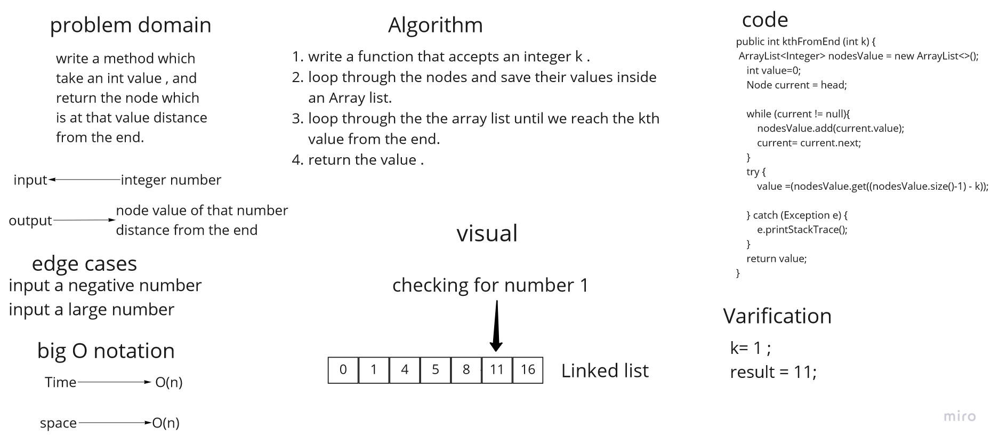
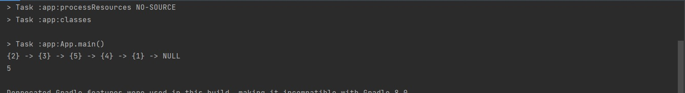

# Challenge Summary
adding a method called kthFromEnd which accept an int parameter k , and return the node which is at k distance from the end of the linked list.

## Whiteboard Process


## Approach & Efficiency
time big O = O(n) because i used while loop.

space big O = O(n) because i used an Array list.

## Solution

runs the method example:

```
System.out.println(testList.kthFromEnd(4));
```

output:



