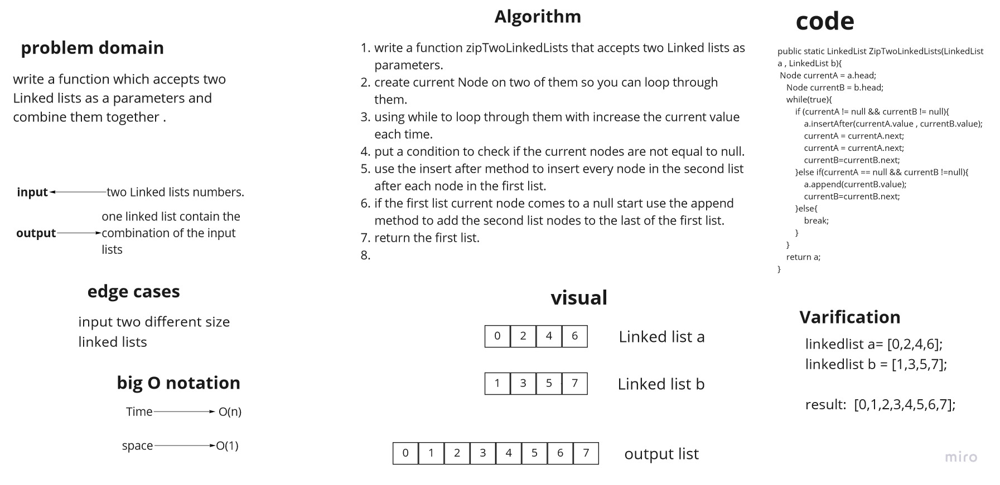
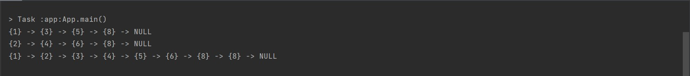

# Challenge Summary
writing a function that accept two linked lists as a parameters, and retern a linked list which have both of them combined.

## Whiteboard Process


## Approach & Efficiency
the big O notaion of my solution was as the following:

time big O = O(n)   because i used a while loop to iterate through the linked lists.
space big O = O(1) because i didnt use any type of arrays
## Solution
example of the code :

```
 LinkedList testList = new LinkedList();
        testList.insert(8);
        testList.insert(5);
        testList.insert(3);
        testList.insert(1);

        LinkedList testList2 = new LinkedList();
        testList2.insert(8);
        testList2.insert(6);
        testList2.insert(4);
        testList2.insert(2);

        System.out.println(testList);
        System.out.println(testList2);


        System.out.println(zipTwoLinkedLists(testList,testList2));
```

and this is its output:



