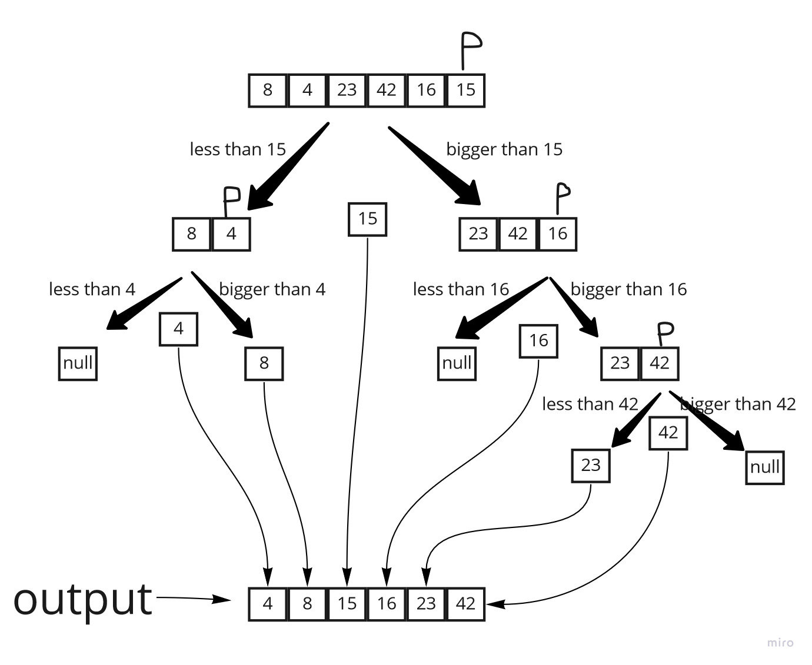

# Quick Sort
> Quicksort is an in-place sorting algorithm. Developed by British computer scientist Tony Hoare in 1959 and published in 1961, it is still a commonly used algorithm for sorting. When implemented well, it can be somewhat faster than merge sort and about two or three times faster than heapsort.

### Pseudo code

```
ALGORITHM QuickSort(arr, left, right)
    if left < right
        // Partition the array by setting the position of the pivot value
        DEFINE position <-- Partition(arr, left, right)
        // Sort the left
        QuickSort(arr, left, position - 1)
        // Sort the right
        QuickSort(arr, position + 1, right)

ALGORITHM Partition(arr, left, right)
    // set a pivot value as a point of reference
    DEFINE pivot <-- arr[right]
    // create a variable to track the largest index of numbers lower than the defined pivot
    DEFINE low <-- left - 1
    for i <- left to right do
        if arr[i] <= pivot
            low++
            Swap(arr, i, low)

     // place the value of the pivot location in the middle.
     // all numbers smaller than the pivot are on the left, larger on the right.
     Swap(arr, right, low + 1)
    // return the pivot index point
     return low + 1

ALGORITHM Swap(arr, i, low)
    DEFINE temp;
    temp <-- arr[i]
    arr[i] <-- arr[low]
    arr[low] <-- temp
```

### big O notation

Time complexity: O(n^2)

Space complexity: O(1)

### Tracing

sample array = [8,4,23,42,16,15]

#### Pass1:

the first thing we devide the array into two halves , one half is less than the Pivot and the other one is larger.

#### Pass2:

the two halves will be devided again in the same way as we did in pass1 so we will have 4 arrays now.

#### pass3:

+ the same thing in the pass1 one will keep happening untill the whole elements of the array are sorted from the smallest to largest.
+ whenever you see a P in the picture that means this is the pivot which we will devide the array accordingly.

