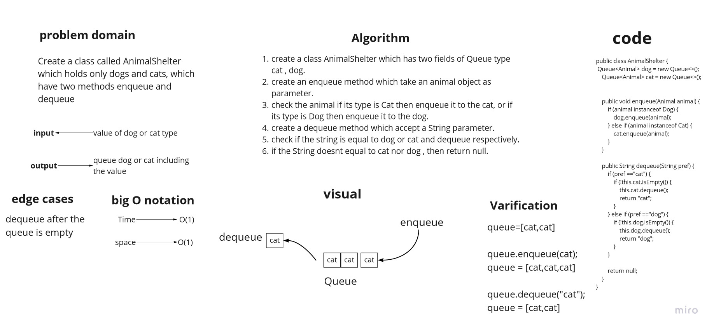
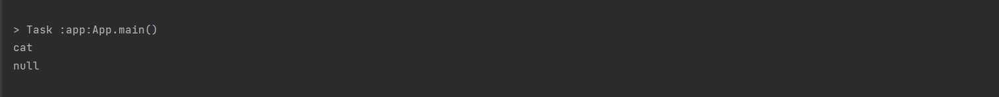

# Challenge Summary

Create a class called AnimalShelter which holds only dogs and cats.
The shelter operates using a first-in, first-out approach.
Implement the following methods:
enqueue: takes animal argument which can be a dog or cat object.
dequeue: takes pref as argument and it can be a dog or a cat , return dog or cat based on preference.

## Whiteboard Process

## Approach & Efficiency
the two methods big O notation = O(1) for both enqueue and dequeue

## Solution
example:

```
  AnimalShelter test = new AnimalShelter();
        Animal animal = new Cat();
        test.enqueue(animal);
        System.out.println(test.dequeue("cat"));
        System.out.println(test.dequeue("cat"));
```

output:
