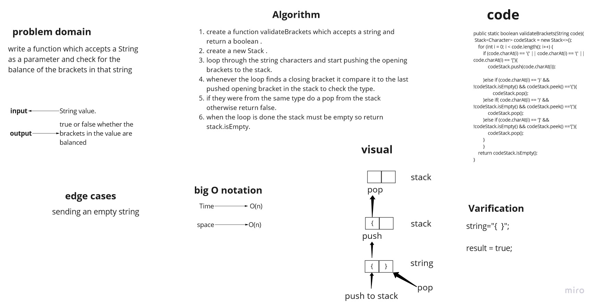
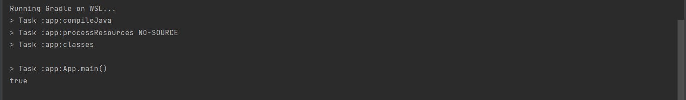

# Challenge Summary
this challenge was about creating a function which accepts a string as parameter and check for the balance of the brackets in it.
## Whiteboard Process


## Approach & Efficiency
the big O notation for this function was O(n) for both time and space complexity because we used for to loop through the string characters and we created a new stack to keep tracking the brackets.

## Solution
this an example of how to run the code :

```
  String test = "{}{Code}[Fellows](())";

  System.out.println(validateBrackets(test));
```

and here is its output :


