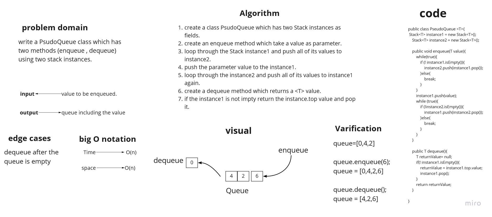
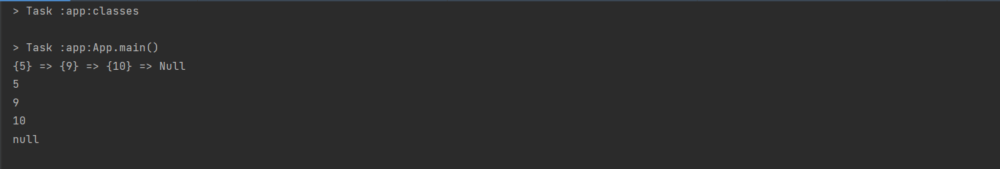

# Challenge Summary
create a PseudoQueue class which have two Stack instances as fields, and two methods : enqueue , dequeue.

## Whiteboard Process


## Approach & Efficiency
the enqueue method has a big O(n) for both time and space comlexity.
the dequeue method has a big O(1) for both time and space compexity.

## Solution

code example:

```
PseudoQueue<Integer> test = new PseudoQueue<>();
        test.enqueue(5);
        test.enqueue(9);
        test.enqueue(10);

        System.out.println(test.instance1.toString());

        System.out.println(test.dequeue());
        System.out.println(test.dequeue());
        System.out.println(test.dequeue());
        System.out.println(test.dequeue());
```

output:

