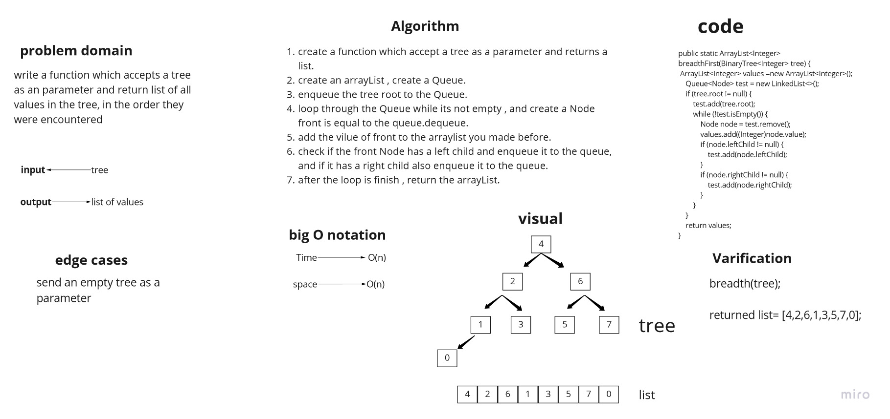
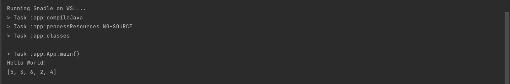

# Challenge Summary
this challeng is about writing a function which accepts a tree as an parameter and return list of all values in the tree, in the order they were encountered

## Whiteboard Process


## Approach & Efficiency
the big O notation of the breadth function is O(n) for both time and space complexity, because i used while to loop and i created a list.

## Solution
this is an example of how to use the function :

```
 BinarySearchTree<Integer> test = new BinarySearchTree<>(5);
        test.root.leftChild = new Node<>(3);
        test.root.rightChild = new Node<>(6);
        test.root.leftChild.leftChild = new Node<>(2);
        test.root.leftChild.rightChild = new Node<>(4);

```

the output is:


