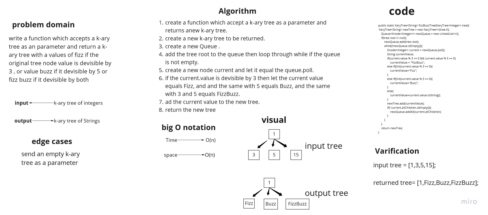

# Challenge Summary
write a function which accepts a k-ary tree as an parameter and return a k-ary tree with a values of fizz if the original tree node value is devisible by 3 , or value buzz if it devisible by 5 or fizz buzz if it devisible by both

## Whiteboard Process


## Approach & Efficiency
the big O notation of the fizzBuzz function is O(n) for both time and space complexity, because i used while to loop and i created a queue.

## Solution
example: 

```
        KaryTree<Integer> test = new KaryTree<>(3);
        test.add(3);
        test.add(4);
        test.add(6);


        System.out.println(fizzBuzzTree(test).root.value);
```

output:
