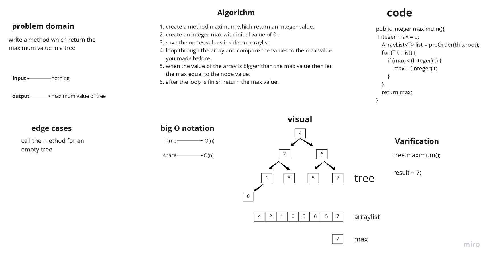

# Challenge Summary
write a method which return the maximum value in a tree.

## Whiteboard Process


## Approach & Efficiency
the big O notation for this method was O(n) for both time and space complexity, because we used loops and we created an arraylist.

## Solution

this is an example of how to use the code:

```
 BinarySearchTree<Integer> test = new BinarySearchTree<>(5);
        test.root.leftChild=new Node<>(3);
        test.root.rightChild=new Node<>(6);
        test.root.leftChild.leftChild=new Node<>(2);
        test.root.leftChild.rightChild=new Node<>(4);


      

        System.out.println(test.maximum());
```

output:


